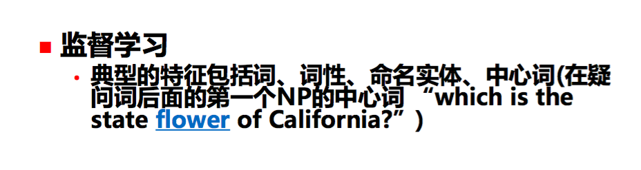

# QA
A Chinese Question and Answer System

## Stages

- Question Processing
    - Word segmentation
    - Output:
        1. **Query formulation**
            - Keywords
        2. Question **Classification**
            - Learning? Rules?

- Passage Retrieval
    - Passage word segmentation
    - Passage index (perhpas not necessary)
    - Input: Keywords
    - Output: Possible paragraphs / sentences (with order of possibilities?)
        - Filter according to entities and question classification
        - Sort using rules or learning

- Answer Extraction
    - Algorithm
        - N-gram?
        - Template matching? **Template learning** using Search Engines?

- (Optional) Answer Refinement
    - Perhaps another filtering and sorting of answer candidates

## Specific

### Question Processing
#### Query formulation

- segmentalize words
- use names, times, locations, other nouns, etc as Keywords (excluding stop words)
- another step: maybe use word2vec to discover synonyms (5 words for example) and add them to keywords as well

#### Question Classification

- 学习－分类
    - 类别：人名，时间，地点，数字，专有名词，其它名词，一句话
- 学习－聚类
- 学习－特征
    - 
    - 中文情况
        - "是"前的词（中心词）
        - 命名实体
        - （非停用词的？）动词
        - 词，词性
